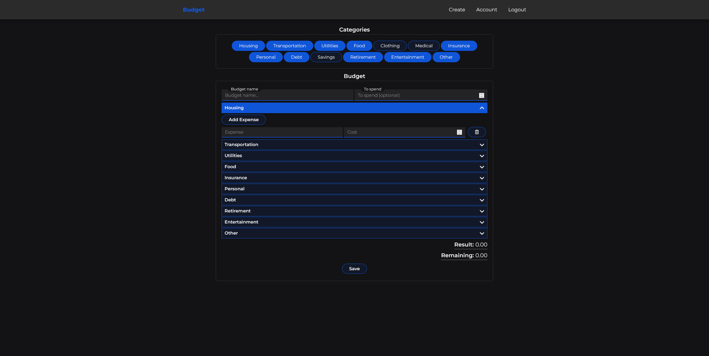

# Budget
## Description:
Web application for creating, editing and viewing budgets. You are required to create an account to use it, you can then use the username or email you provided along with the password to log in. There are a number of categories provided for you to separate your expenses, the categories can be toggled on or off. To add expenses you simply open the accordion menu for the specified category and click the add expense button. To remove an expense click the delete button next to the input fields. The required fields in order to save a budget are:
- Budget name
- At least one active category
- At least one expense with cost provided

Money to spend doesn't need to be provided, however the amount of money remaining will not be calculated in that case. Expenses don't need to be provided, but will be given a generic name expense with an incremented number appended ex. "expense1" once the budget is saved.

Once a budget has been saved it can be seen in a list sorted by most recent on the index page. From here you can click the budget to open it for viewing/editing or deleting it by hitting delete and confirming it. When you've opened a saved budget you will see the categories and expenses associated with that budget, by default the fields and categories are disabled. In order to make changes hit the edit button, make your changes and hit save, just like when creating a budget. 

You will also have access to a basic page of your account information. This is also where you can change your password and delete your account. Deleting your account will also delete all of the budgets associated with the user from the database.

> [!NOTE]
> - Passwords are hashed before being stored. 
> - Budget (to spend), result and expense costs are all encrypted before being stored.
> - The database url and key for encryption/decryption are stored in a .env file for security reasons (not included in version control).

To run the app:
```python
flask run

# Debug mode
flask run --debug
```

## Technologies:
- Python
- Flask
- HTML
- JavaScript
- CSS
- Jinja
- PostgreSQL

See [requirements.txt](requirements.txt) for python libraries.

## Database:
The database used for this project is Postgresql, however since the database tables were declared using SQLAlchemy's ORM, making it easier to use another database if so desired. Sessions are also stored in the database. The path for the database should be saved in an environment variable called DATABASE_URL in order for app.py and create_tables.py to be able to connect to the database. Passwords are hashed before they are stored. Budget total, expense costs and the result are all stored encrypted as binary data in the database. The data is encrypted using the python cryptography/pyca library (https://cryptography.io/en/latest/), before being inserted into the database. It's decrypted before being returned from routes that need to display the numerical values.

## Files:
### app.py
This is the main file of the backend for the project. It's a Flask application containing all of the routes, handling the user sessions, and the functionality for running database queries etc. At the top of the file is the app configuration, connecting to the database and configuring the session. The key for encryption/decryption is retrieved from the environment variables and stored as a "constant" (not enforced by python). The valid categories are also defined at the top part of the file, to make it easier to control which categories are allowed to be stored in the database. Error checking when creating a budget happens on the client-side as well as on the server-side to try to prevent invalid data ending up in the database. A couple of error handlers for HTTP repsonse status codes were added to give nicer user feedback compared to the default ones Flask provides.

```python
@app.route("/")
@login_required
def index()
```
*The index route is used for rendering the index page. It queries the database for all of the budgets of the current user, using the sessions user id.*

```python
@app.route("/budget/<int:id>")
@login_required
def budget(id)
```
*This is a variable route used for rendering a budget page based on budget id. It queries the database for a budget with the id. If it doesn't exist a 404 error code is rendered. If the budget doesn't belong to the current users id a 401 code is rendered. If all goes well a JSON is created containing the budget information to make it consistent with how a budget is created.*

```python
@app.route("/create", methods=["GET", "POST"])
@login_required
def create()
```
*The create route will render the create page on a GET request and will receive collected form data from a POST request. It looks for a JSON in the request and performs some error checking on the data. If there's an error a JSON response will be sent in order to display the error message to the user on the page. Otherwise it will create a new budget, add it to the databse. Then create new expenses and add them to the database. Providing nothing went wrong it will then commit the changes and return a JSON with the route to redirect to.*

```python
@app.route("/update", methods=["POST"])
@login_required
def update()
``` 
*The update route works very similarly to the create route, except it doesn't render a page. It gets a JSON in the request and performs some error checking. It then updates the budget fields. The old expenses get deleted as it seemed unneccesary to update them since there's no history being stored. Then new expenses get added and finally if there were no errors the budget and expenses get committed.*

```python
@app.route("/delete", methods=["POST"])
@login_required
def delete()
```
*The delete route doesn't render a page, it will get an id when the user wants to delete a budget. It then queries the database for the budget and if the budget exists and the users id matches the user id stored for that budget it deletes it and redirects the user to the index page. If the budget was not found a message will be displayed informing the user.*

```python
@app.route("/account")
@login_required
def account()
```
*The account route will render the account page. It queries the database for the user, using the current users session id. If there was no user with that id it will display an error code 404 page. If a user was found it will render the account page.*

```python
@app.route("/change-password", methods=["POST"])
@login_required
def change_password()
```
*The change password route will get the inputs from the change password form on the account page. It will run some error checking. Then check the old password against the one stored in the database. If an error occurs an error message will be displayed to the user. If there's no error a new password hash will be generated and the users password will be updated.*

```python
@app.route("/logout")
def logout()
```
*The logout route simply clears the session to forget the user id and then redirects the user.*

```python
@app.route("/login", methods=["GET", "POST"])
def login()
```
*This route renders the login template on GET requests and will perform login operations on POST requests. If it's a POST request it will query the database against the username or email and then check that the password matches. If username or email and password matches the user will be logged in. If there's an error it wil be displayed to the user.*

```python
@app.route("/register", methods=["GET", "POST"])
def register()
```
*This route renders the register template on GET requests and will allow a user to register an account on POST requests. Once a POST request is sent it will perform some error checking on the users input. If there's an error it will display the error to the user. Otherwise it will create a new user, hashing the password, adding the user and committing it to the database.*

```python
@app.errorhandler(404)
def page_not_found(e)

@app.errorhandler(401)
def unauthorized(e)
```
*These routes gets triggered on 404 and 401 error codes and renders a template displaying the error message and code along with a generated image.*

```python
@app.errorhandler(500)
def server_error(e)
```
*This route gets triggered on a 500 error code and renders a template displaying the error message and code along with a generated image.*

### create_tables.py
This is the file you run to create the database tables. If the tables already exist in the database they will not be updated or overwritten.
```python
python create_tables.py

> Created tables
```

### db_models.py
This is where the database tables are declared using the SQLAlchemy ORM. It contains declarations for the following tables:

```python
__tablename__ = "users"

id: Mapped[int] = mapped_column(primary_key=True)
username: Mapped[str] = mapped_column(String(100), unique=True)
username_lower: Mapped[str] = mapped_column(String(100), unique=True)
password: Mapped[str]
email: Mapped[str] = mapped_column(unique=True)

budget: Mapped[List["Budget"]] = relationship(back_populates="user", cascade="all, delete")
```

```python
__tablename__ = "budgets"

id: Mapped[int] = mapped_column(primary_key=True)
user_id: Mapped[int] = mapped_column(ForeignKey("users.id"))
budget: Mapped[Optional[bytes]] = mapped_column(LargeBinary())
result: Mapped[bytes] = mapped_column(LargeBinary())
name: Mapped[str]
timestamp = mapped_column(TIMESTAMP(timezone=True), nullable=False, server_default=func.now())

user: Mapped["User"] = relationship(back_populates="budget")
expenses: Mapped[List["Expense"]] = relationship(back_populates="budget", cascade="all, delete")
```

```python
__tablename__ = "expenses"

id: Mapped[int] = mapped_column(primary_key=True)
budget_id: Mapped[int] = mapped_column(ForeignKey("budgets.id"))
category: Mapped[str]
note: Mapped[Optional[str]] = mapped_column(default="expense")
amount: Mapped[bytes] = mapped_column(LargeBinary())

budget: Mapped["Budget"] = relationship(back_populates="expenses")
```
The users table has a relationship with the budgets table so that budgets associated with the user are easy to access. The budgets table has a relationship with the users and expenses tables, which makes it easier to access the user from the budgets table and all expenses associated with a budget. Finally the expenses
table has a relationship with the budgets table. These relationships also make it easier to delete data from the database. If a budget is deleted, so are all the expenses associated with it, and if a user is deleted then so are all of their budgets and expenses. 

### generate_secret_key.py
Used to generate a key for encrypting and decrypting data. Remember to store the key somewhere safe, in this case it's stored in a .env file, which is not included for security reasons.
```python
python generate_secret_key.py

> SECRET_KEY: b'supersecretkey'
```
> [!TIP]
> The environment variables are stored as strings, so don't include the "b" type before the key string. It will be encoded in app.py before being stored in the KEY variable.

### helpers.py
This file contains some helper functions that are used in app.py The login_required decorator function is defined here, which ensures that a user is logged in before potentially sensitive information is displayed. There's also a function for error checking the form input received when creating/updating a budget. Lastly it contains a function for escaping characters to be used in a URL when generating a link with https://memegen.link/ (which is used to provide an image when a HTTP error response occurs).

### static/script.js
This file is where the frontend functionality is located. It consists of a number of different functions most of which are called inside of an event listener for DOMContentLoaded.

### static/classes.js
This is where the Alert class used to create alerts, as well as clear them and add a timed red background to a chosen DOM element is defined. Accordion functionality, adding/removing inputs, user feedback for name collisions, calculating/updating the result/remaining, enabling/disabling editing, toggling categories on/off, scrolling the page back to the top and collecting the data input into the budget form, error checking it and sending it to the server.

### static/styles.css
This is where the the styling for the HTML is defined. Responsive styling can be found towards the bottom, converts the navbar to a hamburger nav and makes the content take up more space on smaller screens.

### templates/*
This folder contains HTML templates. All of the templates extend "layout.html" and are to some extent generated using Jinja. For example "400.html" is used for all 400 response codes, using placeholders to display different information depending on what is sent by the server.

### requirements.txt
List of required packages (and their version number) to run the application.

## Images
**Example of Budget Create Page**
